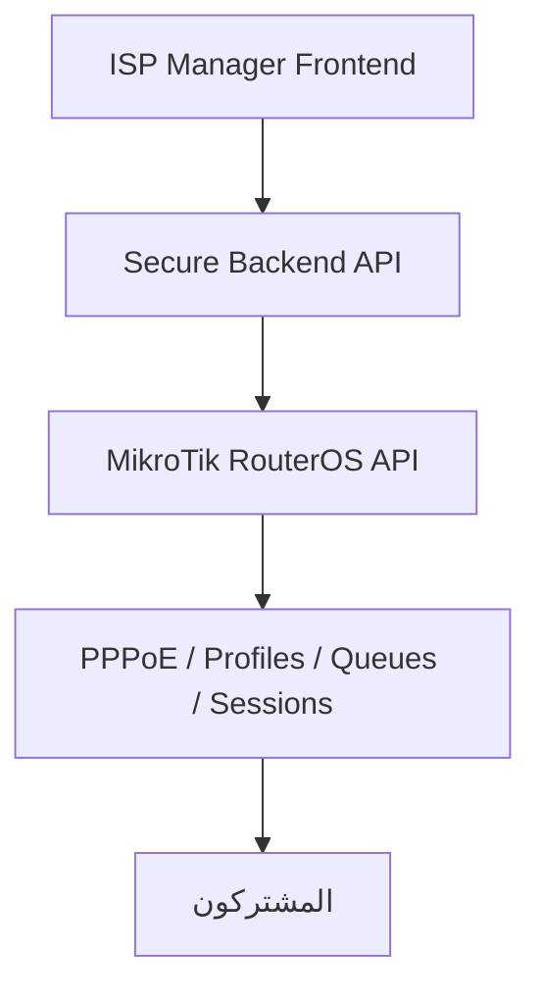

# ISP Manager

لوحة تحكم عربية RTL لإدارة مشتركي الإنترنت. نسخة **Demo / Prototype** فعلية، مبنية بـ React + Vite، ببيانات محلية محفوظة في `localStorage` دون اتصال حقيقي بـ MikroTik أو Starlink.

## المتطلبات والتشغيل

Node.js 22.12 أو أحدث، وnpm.

```bash
npm install
npm run dev
```

يفتح خادم التطوير على `http://127.0.0.1:5173`. للوصول إليه من جهاز آخر في شبكة محلية، استخدم `npm run dev -- --host 0.0.0.0`.

```bash
npm run build
npm run preview
```

مخرجات البناء داخل `dist/`. لا حاجة لقاعدة بيانات أو مفتاح API لهذه المرحلة.

## الوظائف

- لوحة مؤشرات وحركة إنترنت محاكية للفترات 24 ساعة / 7 أيام / 30 يوم.
- إدارة المشتركين: إضافة وتعديل وحذف بتأكيد، وتجديد 30 يوماً أو مدة مخصصة، وإيقاف وإعادة تفعيل، وتغيير الباقة أو السرعة.
- بحث فوري بالاسم والهاتف وUsername وIP، وفلاتر الحالات والاتصال وترتيب النتائج وعرض دفعات.
- تفاصيل المشترك وكلمة مرور تجريبية مخفية افتراضياً وسجل العمليات والاستهلاك المحاكى.
- إدارة الباقات وأسعارها الاختيارية ومددها. لا يسمح بحذف باقة مرتبطة بمشتركين.
- تنبيهات قابلة للقراءة والمسح، وسجل عمليات، وتقارير مشتقة من البيانات الحالية وسجل التجديدات.
- إعدادات الشبكة والعملة والمدد والحد الأدنى للتنبيه وإظهار الأسعار.
- تصدير JSON واستعادته بعد التحقق العميق من بنيته وتأكيد الاستبدال.
- تهيئة PWA وأيقونات وتخزين مؤقت للإتاحة دون إنترنت للموارد التي فُتحت سابقاً.

## البيانات والتواريخ

تضاف 14 عينة عند **أول تشغيل فقط**، بتواريخ نسبية لليوم الحالي. حذف جميع المشتركين لا يعيد العينات. البيانات خاصة بالمتصفح والجهاز والأصل المستخدم؛ ليست مشتركة بين الأجهزة أو المديرين. حذف بيانات المتصفح يمسحها، لذلك صدّر نسخة احتياطية دورياً.

التواريخ الداخلية `YYYY-MM-DD`، والعرض `DD/MM/YYYY`. تُحسب الأيام كتواريخ تقويمية، والوقت الحالي وفق `Asia/Baghdad`؛ لا يُستخدم تحويل التاريخ المحلي إلى UTC عند قراءة حقل التاريخ. التفعيل + 30 يوماً = الانتهاء، مثلاً 02/10/2026 → 01/11/2026. الاشتراك ينتهي عند بداية يوم الانتهاء بتوقيت بغداد.

- فعال: متبقي أكثر من حد التنبيه.
- ينتهي قريباً: من يوم واحد حتى حد التنبيه (7 أيام افتراضياً).
- منتهي: يوم الانتهاء أو بعده. اليوم نفسه يظهر «ينتهي اليوم».
- موقوف: إيقاف إداري يتقدم على حالة المدة.

التجديد الساري يضيف المدة إلى نهاية الاشتراك الحالية، والمنتهي يبدأ من اليوم. التجديد لا يزيل الإيقاف الإداري. إعادة التفعيل لا تجدد اشتراكاً منتهياً ولا تنشئ جلسة اتصال حقيقية. تتم مراجعة الانتهاء عند الفتح وكل 30 ثانية أثناء استخدام الصفحة؛ التشغيل الدائم والإيقاف الحقيقي مستقبلًا مهمة Backend.

تعديل تعريف الباقة لا يغير السرعات المخصصة للمشتركين الحاليين؛ تغيير باقة المشترك يطبق سرعاتها. الأسعار تقديرية، ولا توجد مدفوعات فعلية. تغيير العملة يغير العرض فقط دون تحويل القيم. مبالغ التجديد تحفظ بسعرها وقت العملية.

## هيكل المشروع

```text
src/
  App.jsx                      التنقل وحالة الواجهة
  components/                  عناصر الواجهة والنماذج والحوارات
  pages/                       صفحات النظام (الصفحات الثانوية تحمل عند الطلب)
  services/
    dateService.js             حسابات التواريخ الآمنة
    validationService.js       تحقق المدخلات والنسخ الاحتياطية
    subscriberService.js       إدارة المشتركين والتجديد والحالات
    packageService.js          إدارة الباقات
    notificationService.js     التنبيهات وفحص الانتهاء
    activityService.js         سجل العمليات
    reportService.js           التقارير المشتقة
    storageService.js          التخزين والتصدير والاستيراد
    networkService.js          بيانات الشبكة المحاكية
    mikrotikService.js         موضع ربط Backend مستقبلاً
    store.js                   تحديث ذري وحفظ قبل تحديث الواجهة
    seedService.js             بيانات أول تشغيل
public/                        Manifest والأيقونات وService Worker
  _headers                     رؤوس أمان وكاش لـ Cloudflare Pages
tests/                         اختبارات المنطق والواجهة
```

## الأمان والمرحلة التالية

هذه النسخة ليست نظاماً إنتاجياً ولا تحتوي على مصادقة. جميع كلمات المرور داخل العينات تجريبية؛ لا تدخل بيانات PPPoE حقيقية أو أسرار راوتر في هذه المرحلة. الواجهة لا تتضمن حقول بيانات وصول للراوتر ولا تتصل بـ RouterOS مباشرة.

البنية التالية مستهدفة:



في المرحلة التالية تُستبدل خدمات التخزين والمحاكاة بطلبات Backend مع الإبقاء على الواجهة، ويضاف تسجيل دخول وصلاحيات وقاعدة بيانات وتحقق من جهة الخادم وجدولة انتهاء الاشتراكات. يحتفظ الخادم وحده بمعلومات RouterOS في متغيرات سرية، مع تشفير بيانات الوصول وHTTPS وتدقيق الأوامر. لا تحفظ أسراراً في GitHub أو Frontend.

## النشر على Cloudflare Pages

اربط هذا المستودع فقط: `storeqn/isp-manager-demo`.

- Framework preset: Vite
- Build command: `npm run build`
- Build output directory: `dist`
- Node version: `22` أو إصدار أحدث متوافق
- Root directory: جذر المستودع

التنقل يعتمد hash، فلا يحتاج إعداد إعادة كتابة للمسارات. لا توجد متغيرات سرية مطلوبة. لم يتم نشر النسخة على Cloudflare ضمن هذه المهمة.

لـ GitHub Pages يمكن ضبط `VITE_BASE_PATH=/isp-manager-demo/` عند البناء. Cloudflare يستخدم `/` الافتراضي.

## PWA والتحديثات

التثبيت يتطلب HTTPS أو localhost. على iPhone: Safari ← مشاركة ← إضافة إلى الشاشة الرئيسية. على Android أو Desktop: خيار تثبيت التطبيق في المتصفح.

Service Worker يعمل في الإنتاج فقط، ويستخدم **network first** دون تثبيت ملفات قديمة مسبقاً. ملفات Vite تحمل أسماء مرتبطة بمحتواها. الصفحة وWorker وManifest لا تعتمد كاشاً طويل الأمد، بينما الملفات ذات الأسماء المميزة تخزن طويل الأمد. الإصدار الجديد يظهر عند إعادة الفتح أو إعادة التحميل مع اتصال متاح. الموارد التي لم تفتح من قبل تحتاج اتصالاً أول مرة، ولا تدّعي النسخة تنزيل كل الصفحات تلقائياً.

## الاختبارات

```bash
npm test
npm run build
```

اختبارات المنطق تغطي التواريخ وحدود الأيام والتجديد الساري والمنتهي والإيقاف والبحث والباقات والتقارير والتنبيهات والتخزين والتحقق من الاستعادة.

لاختبار الواجهة:

```bash
npx playwright install chromium
npm run dev
# في نافذة ثانية:
npm run test:e2e
# اختبار PWA بعد البناء ومع تشغيل npm run preview:
npm run test:pwa
```

`TEST_URL` يسمح بتغيير رابط خادم الاختبار. تستخدم الاختبارات تاريخاً ثابتاً 03/10/2026 لضمان قابلية الإعادة، وتعمل على مساحة تخزين متصفح معزولة. تختبر الواجهة والعمليات والحفظ والنسخ والاستعادة وأحجام 375 / 390 / 430 / 768 / 1440، وتسجل الصور والنتيجة داخل `test-results/` (غير مضافة إلى Git).

اختبارات المحاكاة لا تثبت الاتصال الحقيقي ولا تغني عن اختبار الأجهزة عند تنفيذ Backend.
